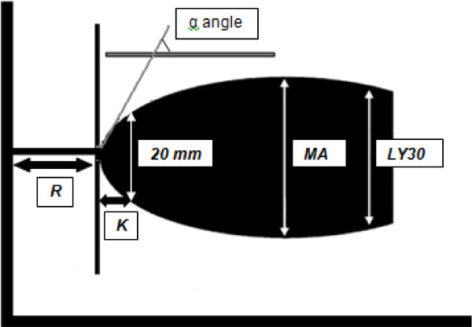

Traumatic injury is the leading cause of death for people between the ages of 1
and 44 @Hoyert2012. Many of these deaths are the result of uncontrolled bleeding
due to a trauma-induced disorder called Acute Traumatic Coagulapathy, or known more simply as
Coagulopathy @Brohi2003. How major trauma causes Coagulapathy and how to treat the disease is still a subject
of ongoing research, but there are various competing hypotheses for why many trauma
patients are coagulapathic. It is generally understood that Coagulopathy comes as
a result of a malfunction in the body's Coagulation Cascade, a complex network of
dynamically interacting proteins in blood that is responsible for forming clots @gonzalez2014trauma.

To better study this complex network, and how it is affected during trauma, doctors
and scientists have two major assays at their disposal: direct protein concentration
measurements and Thromboelastography, or TEG (Figure 1). Direct protein concentration
measurements can tell us the concentration levels of key players in the body's coagulation
system, and thus they can help us acurately understand why a patient's blood is not clotting and how
they can be treated. Unfortunately, these tests are only available at very select
number of hospitals specializing in trauma, they are expensive to run, and most importantly
they are slow to run in a setting where applying the correct treatment as quickly as
possible is of the utmost importance.


In contrast to direct protein measurements, TEG measurements are ubiquitous, inexpensive to run,
and can provide results in as little as 20 minutes. However, they do not measure protein
concentrations directly. Instead, TEG works by placing a small sample of blood in a cup,
chemically initiating the clotting process, then using a metal probe to measure the physical size of the resulting clot
over time in millimeters (mm) (Figure 2). The resulting output is a measure of clot
thickness over time for the patient that is indicative of several important features of
their clotting state including:

* How long it takes for a patient's blood to start forming a clot
* How fast the clot grows once clotting is initiated
* How strong the patient's clots become
* How long the clots are able to maintain their integrity before being broken up by the body


## The Goal: Inferring Protein Concentrations Using TEG and Our Mechanistic Understanding of the Coagulation System.

While TEG measurements clearly contain useful information regarding a patient's clotting state,
they are simply a proxy for the latent system of clotting proteins in the blood that is
much more difficult to measure. Ideally, we can use our mechanistic understanding of the
coagulation system in the form of Ordinary Differential Equations (ODEs) along with a statistical model,
to better understand what exactly TEG is telling us about the state of the underlying coagulation system,
and furthermore infer a patient's protein concentrations using solely their TEG measurements.

# A Mechanistic Model of the Coagulation System

The coagulation system is a well-studied system with several mechanistic ODE models in the literature
that describe how the system evolves dynamically over time. Models for the coagulation system vary
widely in the number of states, reactions, and parameters they contain, including complex models
with up to 80 states @mitrophanov2014kinetic . For our purposes we developed a simple reduced-order model
based of off elements from both the work by @mitrophanov2014kinetic as well as @sagar2015dynamic that captures
the most important players in the coagulation system. The model includes the most basic
components of the clotting process: the coagulation cascade responsible for forming clots,
actual clot material, and clot breakdown or Fibrinolysis (Figure 3). 


The differential equations for this model are shown below. For simplicity we summarized the rate of activation of the protein
FII using a sigmoid delay function that is parameterized by parameters $b$ and $c$ which are specific to the patient. Values for reaction
constants were either gathered from the literature or fit using Maximum A-Posteriori (MAP) estimation.

$$
\begin{eqnarray}
\frac{dFII}{dt} &=& -\mathrm{CascadeDelay(t, b, c)} \cdot  \mathrm{TFPI(t)} \cdot \frac{FII}{K_{FIIa} + FII}\\
\frac{dFIIa}{dt} &=& \mathrm{CascadeDelay(t, b, c)} \cdot  \mathrm{TFPI(t)} \cdot \frac{FII}{K_{FIIa} + FII}-k_{AT}\cdot FIIa \cdot AT\\
\frac{dAT}{dt} &=& -k_{AT}\cdot FIIa \cdot AT\\
\frac{dFg}{dt} &=& -k_{clot} \cdot FIIa \cdot \frac{Fg}{K_{clot} + Fg}\\
\frac{dFn}{dt} &=& k_{clot} \cdot FIIa \cdot \frac{Fg}{K_{clot} + Fg} - k_{lys} \cdot tPA \cdot \frac{Fn}{K_{lys} + Fn}\\
\frac{dtPA}{dt} &=& -k_{PAI}\cdot tPA \cdot PAI\\
\frac{dPAI}{dt} &=& -k_{PAI}\cdot tPA \cdot PAI\\
\end{eqnarray}
$$

Using the R package deSolve, we can forward simulate from this ODE to get an idea of what
the solutions look like:

```{r, message=TRUE}
library(tidyverse)
library(deSolve)

seven.state <- function(t, state, parameters) {
  with(as.list(c(state, parameters)), {
    
    cascade_delay <- 1/(1+exp(c-b*t))
    tfpi <- (1-tfpi_min)/(1+exp(-ct+bt*t)) + tfpi_min

    r_FIIa <- k_FIIa*cascade_delay*tfpi*((FII/g_FII)^c_FIIa)/(K_FIIa + (FII/g_FII)^c_FIIa)
    r_AT <- k_AT*FIIa*(AT/g_AT)
    r_clot <- k_clot*FIIa*((Fg/9e-6)^c_clot)/(K_clot + (Fg/9e-6)^c_clot)
    r_lys <- k_lys*tPA*(Fn^c_lys)/(K_lys + Fn^c_lys)
    r_PAI <- k_PAI*tPA*PAI
    
    dFII <- g_FII*(-r_FIIa)       # pct activity
    dFIIa <- r_FIIa -r_AT         # 10s of nmol/L
    dAT <- -g_AT*r_AT             # pct activity
    dFg <- -r_clot                # 1 mg/dl = 29.41 nmol/L
    dFn <- 1e7*(r_clot - r_lys)   # mm of clot
    dtPA <- -r_PAI                # 1 ng/mL = 14.29 pmol/L     
    dPAI <- -r_PAI                # 1 ng/mL = 23.26 pmol/L
    
    list(c(dFII, dFIIa, dAT, dFg, dFn, dtPA, dPAI))
  })
}

parameters <- c(g_FII = 100/1.4e-6, g_AT = 100/3.4e-6,
                c = 5.0, b = 0.4e-1,
                ct = 10, bt = 0.15e-1, tfpi_min = 0.2,
                k_FIIa = 3.5e-9, c_FIIa = 1, K_FIIa = 1.4e-6,
                k_AT = 1.6e4,
                k_clot = 3.0, c_clot = 1, K_clot = 0.75,
                k_lys = 1, c_lys = 1, K_lys = 0.5,
                k_PAI = 4.5e5)

state <- c(FII = 1e2, FIIa = 0, AT = 100, Fg = 9e-6, Fn = 0, tPA = 7e-11, PAI = 4e-10)

times <- seq(0, 1800, by = 2)

out <- ode(y = state, times = times, func = seven.state,
           parms = parameters, method = "bdf",
           atol = 1e-6, rtol = 1e-5) %>% as.data.frame %>% as_tibble

out %>%
  gather(state, value, -time) %>%
  mutate(state = factor(state, levels = c("FII", "FIIa", "AT", "Fg", "Fn", "tPA", "PAI"))) %>%
  ggplot(aes(time,value)) + geom_line() + facet_grid(state ~ ., scales = "free")
```


### A Mechanistic Model for TEG

While the model includes the concentration of $Fn$ (Fibrin) which formed clots are comprised of,
actual clot thickness which TEG measures is not measuring $Fn$ per se, but some function of it.
Following @sagar2015dynamic , we used the Hill function

$$
\mathrm{ClotThickness(t)} = k \frac{Fn^2}{K + Fn^2}
$$
with $k = 64.0$ and $K = 100.0$. Clot thickness is plotted below for ODE we simulated above:

```{r, message=TRUE}
Fn <- out$Fn
ClotThickness <- 64.0 * Fn^2/(100.0 + Fn^2)
qplot(times, ClotThickness, geom = "line")
```

# Inferring Hybrid Mechanistic-Statistical Models and the Unorthodox Nature of TEG Data
Typically, mechanistic ODE models are fit in Stan using data that consists of the
states of the ODE over time, see e.g. @carpenterPredatorPrey2018 or @margossianOde2017 . In these settings
one typically posits an error distribution for the data that is centered around the forward simulated values of the ODE.
In contrast, our TEG data does not come in the form of clot thickness over time, but rather
in the form of four quantities derived from the clot thickness curve that are typically used in the medical community to summarize the
most important properties of a TEG curve (Figure 4). These four quantities are described below:

1. **R:** The time (in minutes) for the clot to reach 2 mm. This quantity represents the time it takes for the clotting process to initiate.
2. **K:** The time (in minutes) for the clot to reach 20 mm from the time it reached 2 mm. This quantity represents speed of clot formation.
3. **MA:** The maximum amplitude of the clot i.e. the size of the clot when it is at its largest. This quantity measures the strength of a patient's clot.
4. **Ly30:** The percentage of the clot which has broken down after 30 minutes as compared to the maximum amplitude of the clot. This quantity measures how fast clots are being broken up.



To use these quantities to infer unknown parameters and initial conditions, we must first forward simulate our ODE,
compute the clot thickness as a function of $Fn$, then use the trajectory of clot of thickness over time
to derive our simulated TEG data, which we finally can compare to our data by positing some statistical model.
We describe the finer points of this process in the following section.


# Inferring ODEs Using Hitting Time and Max Data in Stan


# Testing our Code on the ODE Test Equation

```{r, message=TRUE}
library(rstan)
options(mc.cores = parallel::detectCores())

fit.test.eq.cpp.src <- stanc("stan/fit_test_eq.stan", allow_undefined = TRUE)$cppcode

fit.test.eq.stan.model <- stan_model("stan/fit_test_eq.stan", allow_undefined = TRUE,
                         includes = paste0('\n#include "', file.path(getwd(), 'src/cubic_spline_solvers.hpp'), '"\n'))

test.eq.stanfit <- sampling(fit.test.eq.stan.model, chains = 4, iter = 1000,
                data = list(Nt = 200, ts = seq(0.01, 2.0, by = 0.01), teg = 0.5108256),
                init = list(list(y0 = array(1,1)), list(y0 = array(1,1)), list(y0 = array(1,1)), list(y0 = array(1,1))))
```

```{r, message= FALSE, warning=FALSE}
test.eq.stanfit
pairs(test.eq.stanfit, pars = c("y0", "teg_sim"))

test.eq.stan.samples <- rstan::extract(test.eq.stanfit, pars = c("y0", "teg_sim"))

tibble(y0.prior = rnorm(2000, 1, 0.1), y0.posterior = test.eq.stan.samples$y0[,1]) %>%
  gather(Distribution, Value) %>%
  mutate(Distribution = factor(Distribution, levels = c("y0.prior", "y0.posterior"), labels = c("Prior", "Posterior"))) %>%
  ggplot(aes(Value)) +
  geom_histogram(binwidth = 0.01) +
  facet_grid(Distribution ~ ., scales = "free") +
  xlab(expression(y[0]))

```

# Putting it All Together to Infer Protein Concentrations Using TEG Data

```{r, message= FALSE, warning=FALSE}
patient.data <- tibble(sex = "Male", age = 22, inj.mech = "StabWound",
                       FII = 90, AT = 115, Fg = 162*29.41*1e-9, tPA = NA, PAI = NA,
                       R = 0.8, K = 1.5, MA = 60.2, Ly30 = 1.7)

patient.data
```

```{r, message=TRUE}
times <- c(seq(0, 600, by = 6), seq(660, 1800, by = 60))

proteins <- patient.data %>% select(FII, AT, Fg, tPA, PAI) %>% as.matrix %>% as.vector
proteins <- ifelse(is.na(proteins), -1, proteins)

teg <-  patient.data %>% select(R, K, MA, Ly30) %>% as.matrix %>% as.vector

num_missing <- c(0,0,0,1,1)

dat <- list(Nt = length(times), ts = times, proteins = proteins, teg = teg, num_missing = num_missing)

teg.cpp.src <- stanc("stan/fit_teg.stan", allow_undefined = TRUE)$cppcode
teg.stan.model <- stan_model("stan/fit_teg.stan", allow_undefined = TRUE,
                         includes = paste0('\n#include "', file.path(getwd(), 'src/cubic_spline_solvers.hpp'), '"\n'))

teg.fit <- sampling(teg.stan.model, chains = 1, iter = 1000, data = dat,
                control = list(adapt_delta = 0.9, max_treedepth = 8), refresh = 100,
                init = list(list(FII_missing = rep(72.0, num_missing[1]),
                                 AT_missing = array(82.0, num_missing[2]),
                                 Fg_missing = rep(5.470260e-06, num_missing[3]),
                                 tPA_missing = array(1.60e-10, num_missing[4]),
                                 PAI_missing = array(3.36e-10, num_missing[5]),
                                 theta = c(2.929422, 0.03441414))))

```

```{r}
teg.stan.samples <- rstan::extract(teg.fit, pars = c("tPA_missing"))

tibble(tPA.prior = rexp(500,1/(4e-10)), tPA.posterior = teg.stan.samples$tPA_missing[,1]) %>%
  gather(Distribution, Value) %>%
  #mutate(Distribution = factor(Distribution, levels = c("y0.prior", "y0.posterior"), labels = c("Prior", "Posterior"))) %>%
  ggplot(aes(Value)) +
  geom_histogram() +
  facet_grid(Distribution ~ ., scales = "free") +
  xlab(expression(y[0]))
```

## Acknowledgements

Research reported in this publication was performed by the Systems Biology
Coagulopathy of Trauma Program of the US Army Medical Research and Materiel
Command under award number W911QY-15-C-0026.

## References
